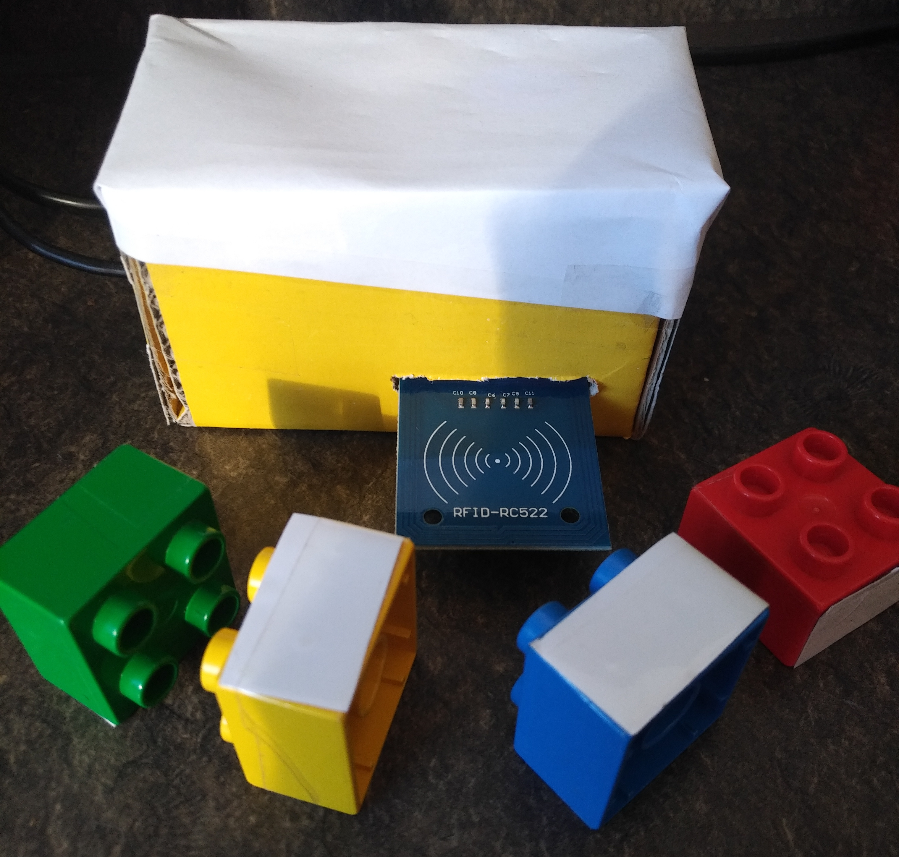
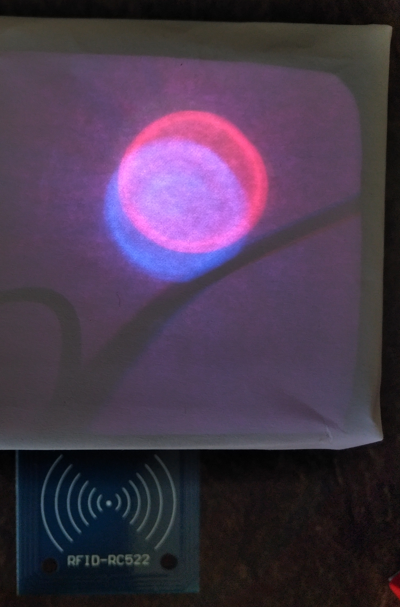

# RGB color mixing using RFID

This project builds a toy that is operated using differently colored tokens (I used duplo bricks) to increase the red/green/blue components of light to showcase the mixing of colors.
The tokens are recognized using RFID tags on the tokens and an MFRC522 RFID reader.
The colors are displayed using a simple RGB-LED.
Logic is provided by an Arduino (Nano).

The toy looks like this:

Here is an example for how mixed colors can look like:

Note:
If you intend to re-build this project, make sure to set the correct UIDs for the RFID tags you use.
